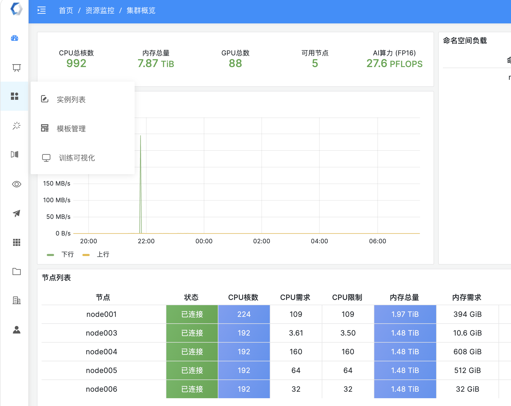
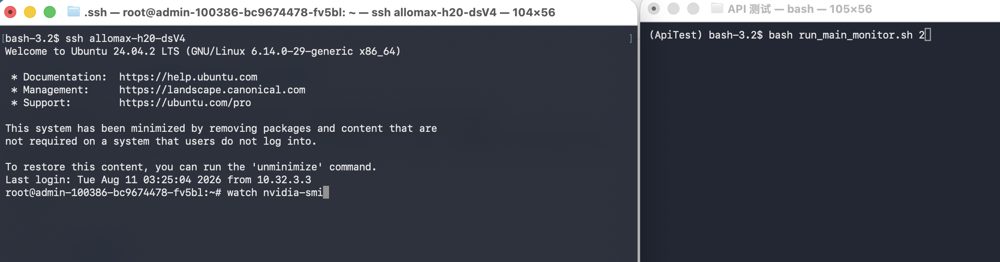
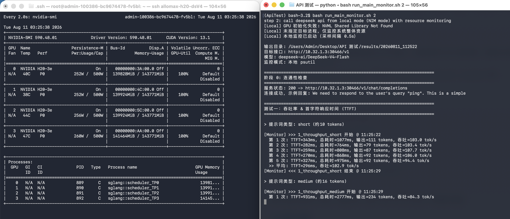

# DeepSeek V4 推理服务基准测试——操作手册

本文档供测试人员和非开发背景的管理者使用，指导如何独立运行基准测试脚本 `deepseek_v4_bench_monitor.py`，对 DeepSeek-V4-Flash 推理服务进行全面的资源占用监控测试。

---

## 一、测试概述

本脚本在一次运行中顺序完成以下四项测试，并自动采集服务器端 CPU、内存、GPU 利用率和显存数据：

| 序号 | 测试项 | 说明 |
|---|---|---|
| 1 | 吞吐量 & TTFT | 对短/中/长三种 prompt 各发多轮流式请求，统计首 token 延迟、生成速率 |
| 2 | 并发测试 | 以中等长度 prompt 为负载，从 1 并发逐步提升至 64 并发 |
| 3 | 上下文长度 | 从 512 tokens 递增至 1,000,000 tokens，观察超长上下文下的资源表现 |
| 4 | 显存消耗估算 | 估算不同负载下的 GPU 显存占用 |

每次测试完成后，在 `results/<时间戳>/` 目录下生成两类产物：
- `resource_log.csv`：全量逐采样点的原始数据
- `summary.json`：各测试分段的聚合均值/峰值（CPU / 内存 / GPU 利用率 / 显存）

---

## 二、测试环境说明

目前有两套推理服务需要测试：

### 环境 A：原生推理服务器（直连容器）

| 项目 | 值 |
|---|---|
| 地址 | `http://10.32.1.3:30466/v1` |
| 模型名称 | `deepseek-ai/DeepSeek-V4-Flash` |
| 部署方式 | NVIDIA NIM 容器（FP4+FP8 混合精度） |
| 硬件 | 4×H20 141GB |

### 环境 B：AI 中台纳管服务

| 项目 | 值 |
|---|---|
| 地址 | `http://10.255.12.38:13206/member1/deepseek/v1` |
| 模型名称 | `deepseek-ai/DeepSeek-V4-Flash` |
| 鉴权 Token | `在 ai 中台进行查询` |
| 部署方式 | AI 中台统一纳管（底层硬件同上） |

---

## 三、准备工作（仅需一次）

### 3.1 安装 OrbStack 并生成 SSH 密钥

OrbStack 是 macOS 上轻量级的容器和虚拟机管理工具，内置终端环境，适合用来管理 SSH 连接。

**步骤 1**：从 [orbstack.dev](https://orbstack.dev) 下载并安装 OrbStack。

**步骤 2**：打开 OrbStack，在终端中生成 ed25519 密钥（相比 RSA 更安全、体积更小）：

```bash
ssh-keygen -t ed25519 -C "benchmark-test-key"
```

提示输入保存路径时直接回车（使用默认 `~/.ssh/id_ed25519`），提示输入 passphrase 时直接回车（留空，方便脚本自动化）。

### 3.2 配置 SSH Config

编辑（或新建）`~/.ssh/config` 文件，添加以下内容：

```
Host allomax-h20-dsV4
    HostName 10.32.1.3
    Port 30467
    User root
    IdentityFile ~/.ssh/id_ed25519
    ServerAliveInterval 60
    ServerAliveCountMax 3
    StrictHostKeyChecking no
    AddKeysToAgent yes
    IdentitiesOnly yes
```

配置项说明：

| 配置项 | 含义 |
|---|---|
| `Host allomax-h20-dsV4` | SSH 别名，后续用 `ssh allomax-h20-dsV4` 即可登录 |
| `HostName 10.32.1.3` | 远程服务器 IP |
| `Port 30467` | SSH 端口（注意不是 22） |
| `IdentityFile ~/.ssh/id_ed25519` | 指定使用刚生成的 ed25519 私钥 |
| `ServerAliveInterval 60` | 每 60 秒发送心跳包，防止长时间闲置被断开 |
| `StrictHostKeyChecking no` | 跳过主机密钥确认（内网环境） |
| `IdentitiesOnly yes` | 只使用此处指定的密钥，不尝试其他密钥 |

### 3.3 登录 AlloMax 管理平台 

打开浏览器，访问：**https://10.32.1.3:9528/**

使用管理员账号登录。登录界面如下图所示：

 

### 3.4 找到 deepseek-v4-flash 实例

登录后进入"实例列表"，找到名称为 **deepseek-v4-flash** 的运行中实例。确认其状态为"运行中"，所属节点和资源配置（如 32核/32G内存/H20-141G）。



### 3.5 进入终端并添加 SSH 公钥

在 deepseek-v4-flash 实例卡片中上部分，点击终端按钮，进入该实例的 Linux 终端界面：


在终端中执行以下命令，将本地 Mac 的 SSH 公钥添加到远程服务器的授权列表：

```bash
# 确保 .ssh 目录存在并设置正确权限
mkdir -p /root/.ssh
chmod 700 /root/.ssh

# 手动将本地公钥内容写入 authorized_keys
# 请先在本地 Mac 终端执行 cat ~/.ssh/id_ed25519.pub，复制输出的内容
# 然后在远程终端中执行（将 <粘贴你的公钥内容> 替换为实际内容）：
echo "<粘贴你的公钥内容>" >> /root/.ssh/authorized_keys

# 设置正确权限
chmod 600 /root/.ssh/authorized_keys
```

> **注意**：容器实例内的 authorized_keys 在实例重启后可能丢失。若重启后 SSH 免密登录失效，需重复本步骤。

### 3.6 验证 SSH 连接

在本地 Mac 终端执行：

```bash
ssh allomax-h20-dsV4 "nvidia-smi"
```

如果能正常输出 GPU 信息，则 SSH 配置成功。

---

## 四、运行测试

项目提供了便捷的 Bash 启动脚本，无需记忆复杂的 Python 命令行参数。

### 4.0 Python 环境安装

测试脚本依赖 Python 3.9 及以上版本。如果本地尚未安装，可通过以下方式快速搭建：

```bash
# 安装 Python 3.11（通过 Homebrew）
brew install python@3.11

# 确认版本
python3.11 --version
```

安装依赖包：

```bash
pip3 install httpx
```

仅 `httpx` 一个依赖（用于向推理服务发送 HTTP 请求）。资源监控走 SSH 远程采集，无需在本机安装 `psutil` 或 `pynvml`。

> 若遇到 `pip3: command not found`，请先执行 `python3 -m ensurepip --upgrade` 安装 pip。

### 4.1 双终端监控运行（推荐）

建议在 macOS 上并排打开两个终端窗口，左侧实时观察 GPU 状态，右侧执行测试脚本：

**左侧终端 — GPU 实时监控：**

```bash
ssh allomax-h20-dsV4
watch -n 1 nvidia-smi
```

`watch -n 1` 每隔 1 秒刷新 `nvidia-smi` 输出，直观看到 GPU 利用率、显存占用、功耗变化。

**右侧终端 — 运行测试脚本：**

```bash
cd "/Users/Admin/Desktop/API 测试"
./run_main_monitor.sh 2
```

运行效果如下图所示：





> 左侧 `watch nvidia-smi` 仅用于肉眼观察，不影响右侧脚本自身的后台数据采集。测试结束后按 `Ctrl+C` 退出 watch。

### 4.2 一键运行

```bash
cd "/Users/Admin/Desktop/API 测试"

# 环境 A：原生推理服务器 + SSH 资源监控
./run_main_monitor.sh 2

# 环境 B：AI 中台纳管服务 + SSH 资源监控
./run_main_monitor.sh 3

# 环境 A/B 仅跑性能基准（不采集 GPU/CPU 监控数据）
./run_main.sh 2
./run_main.sh 3
```

脚本内部已封装 API 地址、模型名称、鉴权 Token 和 SSH 别名，无需额外配置。

### 4.2 脚本说明

| 脚本 | 用途 | 适用 step 参数 |
|---|---|---|
| `run_main_monitor.sh` | 跑基准测试 + 同步采集远程服务器 GPU/CPU/内存 | `2`（NIM）、`3`（AI 中台） |
| `run_main.sh` | 仅跑基准测试，不采集资源监控数据 | `1`（官方 API）、`2`、`3` |

> step `1` 对应 DeepSeek 官方 API（无本地服务器可监控），`run_main_monitor.sh 1` 等同于 `run_main.sh 1`。

### 4.4 首次运行建议

首次运行前先验证 SSH 连接是否正常：

```bash
ssh allomax-h20-dsV4 "nvidia-smi"
```

确认能输出 GPU 信息后，再执行测试脚本。

---

## 五、结果解读

### 5.1 目录结构

运行完成后，在 `results/` 下会生成一个以时间戳命名的子目录：

```
results/
└── 20260810_153000/
    ├── resource_log.csv          # 全量原始采样数据
    ├── 1_throughput_short.csv    # 分段：吞吐量-短文本
    ├── 1_throughput_medium.csv   # 分段：吞吐量-中文本
    ├── 1_throughput_long.csv     # 分段：吞吐量-长文本
    ├── 2_concurrency_1.csv       # 分段：并发-1
    ├── ...                       # 2_concurrency_2 ~ 64
    ├── 3_context_512.csv         # 分段：上下文-512 tokens
    ├── ...                       # 3_context_1024 ~ 1000000
    ├── 4_memory_estimation.csv   # 分段：显存估算
    └── summary.json              # 汇总 JSON（核心产物）
```

### 5.2 核心文件：summary.json

这是最重要的产物，包含所有测试分段的聚合统计。打开后结构如下：

```json
{
  "test_time": "2026-08-10 15:30:00",
  "remote_host": "10.32.1.3",
  "tests": [
    {
      "name": "1_throughput_long",
      "duration_s": 12.5,
      "samples": 24,
      "sys_cpu_mean_%": 100.0,
      "gpu_util_mean_%": 99.2,
      "gpu_util_peak_%": 100.0,
      "gpu_mem_mean_mb": 139828,
      "mem_used_mean_mb": 87934
    }
  ]
}
```

### 5.3 关键指标速查

| 字段 | 含义 | 关注点 |
|---|---|---|
| `gpu_util_mean_%` | 该测试段的 GPU 平均利用率 | 越高越好；短文本通常偏低（GPU 空闲间隔），长文本应接近 100% |
| `gpu_util_peak_%` | 该测试段的 GPU 峰值利用率 | 应能达到 100% |
| `gpu_mem_mean_mb` | GPU 显存占用 | 应恒定，若持续增长说明显存泄漏 |
| `sys_cpu_mean_%` | 系统 CPU 使用率 | DeepSeek V4 推理通常接近 100% 满载 |
| `duration_s` | 该测试段实际耗时 | 配合采样数可评估数据充分性 |

### 5.4 特殊情形：长上下文 GPU 利用率偏低

在上下文长度测试（context_131072 和 context_1000000）中，GPU 利用率会出现骤降至 10-20% 的情况。**这不是故障**，而是大模型长上下文推理的固有架构特性：

- 推理分为 **Prefill**（一次性读入全部输入、构建 KV Cache）和 **Decode**（逐步生成输出）两个阶段
- Prefill 阶段瓶颈是显存带宽，GPU 计算单元大量空闲，利用率自然很低
- 待 Prefill 完成后进入 Decode 阶段，利用率即刻恢复至 100%
- 此现象在 DeepSeek 官方 API、OpenAI 等所有 LLM 推理系统中均存在

---

## 六、常见问题

### Q1：运行时报 "SSH connection failed"

检查是否已配置 SSH 免密登录（见第三节）。可用 `ssh root@10.32.1.3 "nvidia-smi"` 单独验证。

### Q2：远程服务器 GPU 数据为空

确认远程服务器上 `nvidia-smi` 可用，GPU 驱动已正确安装。

### Q3：CPU / 内存数据始终为 0

当推理服务以容器方式（NIM）运行时，主机的 `top` 无法直接看到容器内进程的 CPU/内存。此时 CPU 和内存数据无效，仅 GPU 数据可信。这是已知限制，不影响报告结论。

### Q4：测试中途报错退出

查看终端输出中的最后几行错误信息。常见原因：
- 远程服务器磁盘空间不足
- 推理服务未启动或端口不通（先 `curl http://10.32.1.3:30466/v1/models` 验证）
- 网络中断导致 SSH 断连

### Q5：如何只跑部分测试

目前脚本默认按顺序跑全部四项测试。如需跳过某些测试，可在 `deepseek_v4_bench.py` 中注释掉对应函数调用，或联系开发者提供 `--skip` 参数支持。

> 文档版本：v1.0 | 更新日期：2026-08-10
